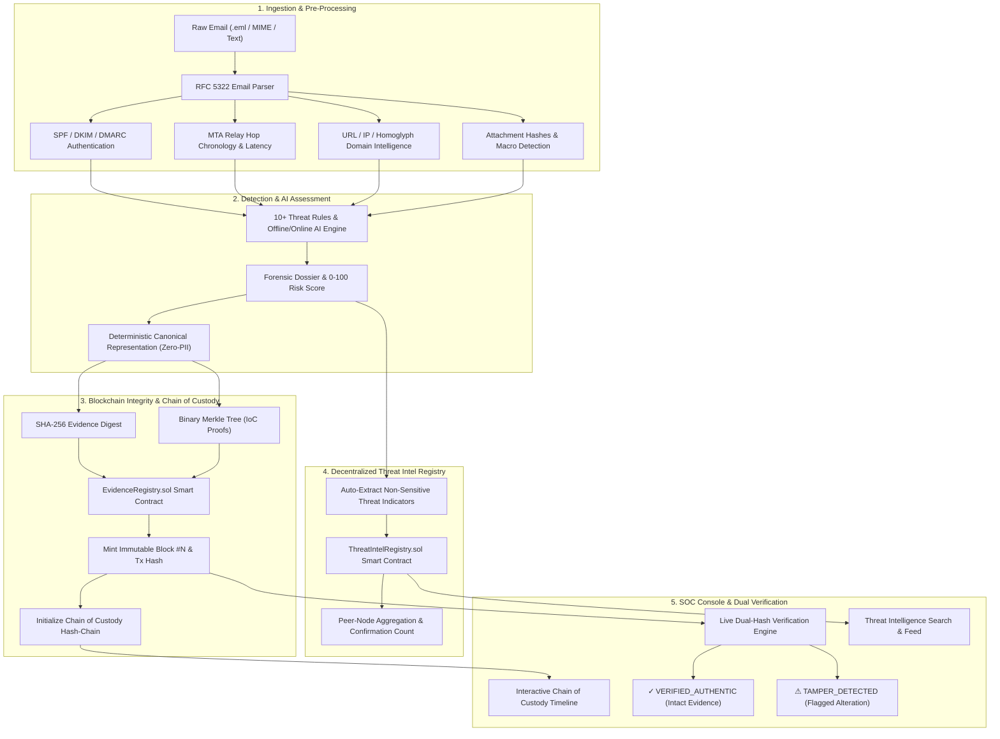

# ThreatSentinel — AI-Powered Email Threat Detection, GeoLocation & Blockchain Forensic Intelligence Platform

[](https://fastapi.tiangolo.com)
[](https://react.dev)
[](https://soliditylang.org/)
[](https://sqlite.org)
[-brightgreen.svg)]()
[]()

> **Smart India Hackathon (SIH)** • Combined Theme: **Blockchain + Cybersecurity (PS 26106)**

---

## 🎯 Executive Overview

**ThreatSentinel** is an enterprise-grade Security Operations Center (SOC) investigation platform combining **AI-powered email forensics, MTA relay hop reconstruction, geolocation mapping, and an immutable Proof-of-Authority (PoA) Blockchain Evidence Registry** with a court-admissible digital **Chain of Custody** and decentralized **Threat Intelligence (IoC) Sharing**.

### 🌟 Key Capabilities

1. **AI & Heuristic Email Forensic Engine**: Parses RFC 5322 MIME payloads, validates SPF/DKIM/DMARC protocols, detects typosquatting/homoglyph domains, executive BEC display name spoofing, malicious attachments, and generates 0–100 risk scoring.
2. **Hop-by-Hop MTA Relay Tracer**: Analyzes `Received:` headers to chronologically reconstruct transit mail servers, geolocates origin IPs, computes transmission delays, and maps infrastructure routes.
3. **Immutable Blockchain Evidence Registry (`EvidenceRegistry.sol`)**: Anchors deterministic canonical evidence digests and Merkle root inclusion proofs to the blockchain.
4. **Cryptographic Chain of Custody (CoC)**: Tracks forensic lifecycle events (`EVIDENCE_CREATED` $\rightarrow$ `ANALYSIS_COMPLETED` $\rightarrow$ `ANALYST_REVIEW` $\rightarrow$ `REPORT_GENERATED` $\rightarrow$ `EVIDENCE_ARCHIVED`) linked via SHA-256 hash-pointers.
5. **Decentralized Threat Intelligence Registry (`ThreatIntelRegistry.sol`)**: Privacy-preserving cross-organizational sharing of verified malicious domains, URL hashes, IP addresses, and file digests.
6. **Controlled Forensic Tamper Demonstration**: Development/demo mechanism to simulate unauthorized local database modification and prove live cryptographic tamper detection.

---

## 🏗️ System Architecture



---

## 🔄 End-to-End Data Flow (17-Step Forensic Lifecycle)

1. **Email Ingestion**: SOC Analyst submits raw email text, `.eml` file, or synthetic fixture via `POST /api/analyze-email`.
2. **RFC 5322 Parsing**: Extracts header dictionaries, MIME multipart boundaries, URLs, and attachment files.
3. **Authentication Evaluation**: Checks `Authentication-Results` for SPF, DKIM, and DMARC alignment.
4. **Relay Hop Reconstruction**: Chronologically traces MTA servers, resolves IP geolocations, and computes transport latency.
5. **Heuristic Rule Evaluation**: Evaluates 10+ rules (Urgency language, BEC spoofing, lookalike domains, macro attachments).
6. **AI Intent Assessment**: Analyzes semantic threat intention, categorization, and confidence scoring.
7. **Risk Score Generation**: Computes normalized 0–100 risk score and assigns risk tier (`Low`, `Medium`, `High`, `Critical`).
8. **Evidence Dossier Construction**: Assembles full investigation findings and assigns immutable `analysis_id`.
9. **Zero-PII Canonicalization**: Serializes structural metadata (`analysis_id`, `threat_classification`, `risk_score`, `auth_summary`, `relay_count`, `system_id`) into deterministic canonical JSON.
10. **Cryptographic Hashing**: Computes SHA-256 canonical evidence hash and constructs binary Merkle tree.
11. **Smart Contract Anchoring**: Invokes `EvidenceRegistry.registerEvidence()` on-chain.
12. **Chain of Custody Initialization**: Mints 4 sequential lifecycle events (`EVIDENCE_CREATED`, `EVIDENCE_ANALYZED`, `AI_ANALYSIS_COMPLETED`, `THREAT_CLASSIFIED`) linked via parent hash-pointers.
13. **Threat Intel IoC Broadcast**: Auto-publishes non-sensitive high-confidence domains, IPs, and hashes to `ThreatIntelRegistry.sol`.
14. **Database Persistence**: Stores analysis dossier, transaction receipt, and custody records in SQLite database.
15. **Live Verification**: When analyst clicks **"Verify Evidence"**, backend recalculates canonical hash from live database and compares against the smart contract proof.
16. **Controlled Tamper Simulation (Demo Mode)**: Analyst clicks **"Simulate DB Tamper"** to alter a field in local storage.
17. **Tamper Detection**: Live verification detects hash mismatch and alerts analyst: `⚠ Evidence Integrity Compromised`.

---

## 📊 Forensic Threat Scoring Criteria & Detection Rules

The platform calculates a deterministic, explainable **0–100 Composite Threat Score** (`calculate_threat_score()`) derived from 12 weighted cybersecurity detection rules evaluated in [`backend/app/scanner.py`](backend/app/scanner.py#L362-L560).

### 🎯 1. Risk Tier Thresholds

| Threat Score | Risk Level | Hex Color | Badge | Incident Triage Action |
|:---:|:---:|:---:|:---:|:---|
| **80 – 100** | `Critical` | `#EF4444` | 🔴 Critical | Immediate automated quarantine; block sender domain & origin IP; alert SOC. |
| **60 – 79** | `High` | `#F97316` | 🟠 High | High-priority analyst triage; flag display-name / BEC impersonation; hold delivery. |
| **30 – 59** | `Medium` | `#FBBF24` | 🟡 Medium | Warning banner injected; external untrusted link warnings displayed to recipient. |
| **0 – 29** | `Low` | `#10B981` | 🟢 Low | Normal delivery; verified cryptographic transport authentication. |

---

### 🛡️ 2. Comprehensive 12-Rule Point Allocation Matrix

| Rule ID | Rule Name | Threat Category | Severity | Points | Trigger Criteria & Explanation |
|:---|:---|:---|:---:|:---:|:---|
| **RULE-01** | `Urgent / Coercive Language` | `SOCIAL_ENGINEERING` | `MEDIUM` | **+15** | Matches urgency cues (*"immediate action required"*, *"account suspended"*, *"wire transfer"*, *"past due invoice"*). |
| **RULE-02** | `Lookalike / Typosquatted Domain` | `DOMAIN_INTEGRITY` | `HIGH` | **+30** | Domain uses visual homoglyphs/typosquatting imitating trusted brands (*"micros0ft.com"*, *"paypa1-security.com"*). |
| **RULE-03** | `Executive BEC Display Spoofing` | `SENDER_INTEGRITY` | `HIGH` | **+35** | Executive title (*"CEO"*, *"CFO"*, *"Director"*) paired with unauthorized free webmail (*"@gmail.com"*, *"@yahoo.com"*). |
| **RULE-04** | `Reply-To Domain Mismatch` | `SENDER_INTEGRITY` | `HIGH` | **+30** | `Reply-To:` header routes responses to a different domain than the sender envelope domain. |
| **RULE-05** | `DMARC Policy Hard Failure` | `AUTHENTICATION` | `CRITICAL` | **+40** | DMARC validation returns `fail`, `hardfail`, or `reject` (unauthorized sender domain spoofing). |
| **RULE-06** | `SPF / DKIM Cryptographic Failure` | `AUTHENTICATION` | `HIGH` | **+25** | Transport authentication fails (`SPF: softfail/fail` or `DKIM: fail/permerror`). |
| **RULE-07** | `Suspicious Raw IP URL` | `URL_INTEGRITY` | `HIGH` | **+25** | Hyperlinks contain bare IPv4/IPv6 addresses rather than registered domain hostnames. |
| **RULE-08** | `Hyperlink Anchor Text Mismatch` | `URL_INTEGRITY` | `CRITICAL` | **+40** | Visible anchor text displays a trusted URL, but the underlying `href` destination routes to a malicious domain. |
| **RULE-09** | `Dangerous / Disguised Attachment` | `ATTACHMENT_SAFETY` | `CRITICAL` | **+65** | Attachment matches executable or weaponized macro extensions (`.exe`, `.scr`, `.vbs`, `.xlsm`, `.iso`, `.hta`). |
| **RULE-10** | `Untrusted Transit Infrastructure` | `INFRASTRUCTURE` | `HIGH` | **+20** | Transit mail routed through an unauthorized VPS relay or known attacker hosting subnet. |
| **RULE-11** | `Missing Mandatory RFC Headers` | `HEADER_INTEGRITY` | `MEDIUM` | **+15** | Email payload lacks mandatory RFC 5322 headers (`Message-ID`, `Date`, or `From`). |
| **RULE-12** | `Malformed / Truncated MIME` | `HEADER_INTEGRITY` | `LOW` | **+10** | Incomplete or corrupted MIME structure without plain body or subject. |

---

### 📚 3. Core Scoring Dictionaries & Keywords

* **Urgent Social Engineering Keywords**: `"urgent"`, `"immediate action"`, `"account suspended"`, `"verify your account"`, `"wire transfer"`, `"unauthorized login"`, `"password expires"`, `"invoice attached"`, `"payroll update"`, `"payment overdue"`, `"tax refund"`.
* **Typosquatting Monitored Brands**: `micros0ft.com` $\rightarrow$ Microsoft, `paypa1-security.com` $\rightarrow$ PayPal, `amaz0n-support.com` $\rightarrow$ Amazon, `g00gle-verify.com` $\rightarrow$ Google, `wel1sfargo-login.com` $\rightarrow$ Wells Fargo, `bank0famerica.com` $\rightarrow$ Bank of America.
* **Executive BEC Monitored Titles**: `"ceo"`, `"chief executive"`, `"cfo"`, `"chief financial"`, `"director"`, `"president"`, `"managing director"`, `"vice president"`, `"founder"`.
* **Free Webmail Providers**: `gmail.com`, `yahoo.com`, `hotmail.com`, `outlook.com`, `protonmail.com`, `icloud.com`, `mail.com`, `aol.com`.
* **High-Risk File Extensions**: `.exe`, `.scr`, `.vbs`, `.js`, `.bat`, `.cmd`, `.ps1`, `.iso`, `.img`, `.hta`, `.wsf`, `.docm`, `.xlsm`, `.pptm`.

---

## 🔒 Privacy & Zero-PII Compliance

To ensure compliance with global data protection standards (GDPR, DPDP) and prevent sensitive data leakage on public/consortium blockchains:

- **Zero Sensitive Content On-Chain**: Raw email bodies, personal names, sender/recipient addresses, passwords, and attachment binaries are **NEVER** stored on-chain.
- **Structural Integrity Proofs**: Only deterministic mathematical digests of statistical and forensic metadata are anchored.
- **Merkle Inclusion Proofs**: Granular indicators (e.g. attachment hashes, malicious domains) are indexed in a binary Merkle tree, allowing cryptographic proof of inclusion without exposing the full dossier.

---

## 📜 Smart Contracts

Located in `contracts/` (ABIs in `backend/app/contracts/`):

### 1. `EvidenceRegistry.sol`
- **`registerEvidence(bytes32 evidenceId, bytes32 evidenceHash, bytes32 merkleRoot, string threatClassification, uint8 riskScore)`**: Anchors evidence integrity proof on-chain with anti-overwrite protection.
- **`verifyEvidence(bytes32 evidenceId, bytes32 computedHash)`**: Read-only verification returning authenticity boolean and block timestamp.
- **`recordCustodyEvent(bytes32 evidenceId, bytes32 eventHash, bytes32 previousEventHash, uint256 sequenceNumber, string eventType, string actor)`**: Records sequentially linked lifecycle events.
- **`verifyCustodyChain(bytes32 evidenceId, bytes32[] eventHashes)`**: Validates continuous hash-chain integrity.

### 2. `ThreatIntelRegistry.sol`
- **`registerIndicator(string indicatorType, string indicatorValue, string threatCategory, uint8 severity, uint8 confidenceScore, string sourceOrg)`**: Anchors verified IoCs with cross-organizational confirmation count aggregation.
- **`verifyIndicator(string indicatorType, string indicatorValue)`**: Looks up provenance and observation counts across participating nodes.

---

## ⚙️ Environment Configuration (`.env.example`)

| Variable | Default | Purpose |
|---|---|---|
| `ENVIRONMENT` | `development` | `development` (enables demo tampering) or `production` (strictly gates demo endpoints with `403 Forbidden`). |
| `DEMO_MODE` | `True` | Enables interactive tamper simulation and demo database resetting. |
| `BLOCKCHAIN_ENABLED` | `True` | Enables or disables blockchain anchoring layer independently. |
| `BLOCKCHAIN_PROVIDER` | `local` | `local` (autonomous PoA validator) or `rpc` (EVM JSON-RPC node). |
| `BLOCKCHAIN_RPC_URL` | `http://127.0.0.1:8545` | EVM JSON-RPC endpoint (Hardhat/Ganache/Anvil/Sepolia). |
| `BLOCKCHAIN_CONTRACT_ADDRESS` | `0x71C80aB8B33f11E81D4b5b4Fe93C9a8Ec0F36D48` | Deployed `EvidenceRegistry` contract address. |
| `BLOCKCHAIN_INTEL_CONTRACT_ADDRESS` | `0x89E23B84Ce1e6D403a7aE505d9b626E6F22eD33C` | Deployed `ThreatIntelRegistry` contract address. |
| `MAX_UPLOAD_SIZE_BYTES` | `15728640` | Maximum email upload payload size (15 MB). |
| `DATABASE_URL` | `sqlite:///./email_threat_platform.db` | Local SQLite database connection URI. |
| `GEMINI_API_KEY` | `""` | Optional Gemini API key; falls back to offline rule engine when empty. |

---

## 🧪 Tamper Detection Demonstration Guide

Follow these steps during your live SIH demonstration to showcase forensic tamper resistance:

1. **Ingest an Email**: Go to the dashboard, click **"Ingest Email"**, select the *Executive Credential Harvest* sample, and submit.
2. **Observe Blockchain Receipt**: Open the analysis dossier. Notice the **Blockchain Evidence Verification** section showing:
   `✓ Evidence Integrity Verified` • Block height, Tx ID, and SHA-256 Canonical Hash.
3. **Inspect Chain of Custody**: View the 4 initialized chronological lifecycle events linked via hash-pointers.
4. **Simulate Database Tampering**: Click the yellow **"Simulate DB Tamper (Demo)"** button in the header card. (This alters the local database risk score to simulate unauthorized tampering).
5. **Run Verification**: Click **"Verify Evidence"**.
6. **Observe Tamper Alert**: The system recalculates the live hash, detects the mismatch against the blockchain ledger, and instantly displays:
   `⚠ Evidence Integrity Compromised` • *Live database evidence hash does not match immutable on-chain registration.*
7. **Restore Authentic Evidence**: Click **"Restore Authentic"** and verify again to restore authentic verified state.

---

## 🛠️ Troubleshooting & FAQ

- **Port 8000 or 5173 already in use**:
  Kill conflicting processes:
  ```powershell
  # Windows PowerShell
  Stop-Process -Id (Get-NetTCPConnection -LocalPort 8000).OwningProcess -Force
  Stop-Process -Id (Get-NetTCPConnection -LocalPort 5173).OwningProcess -Force
  ```
- **Database Reset**:
  Click the **"Reset Database Baseline"** button in the dashboard footer, or call `POST /api/demo/reset`.
- **Offline / Air-Gapped Operation**:
  The system is 100% self-contained. When running without internet or an external RPC node, `BLOCKCHAIN_PROVIDER=local` automatically validates and chains blocks autonomously.

---

## 🚀 Exact Commands to Install, Run, Deploy & Test

### 1. Install Dependencies

```bash
# Clone & enter workspace
cd email-threat-platform

# Install Python backend dependencies
cd backend
python -m pip install -r requirements.txt
cd ..

# Install Frontend dependencies
cd frontend
npm install
cd ..

# Install Smart Contract tools (Optional, for Hardhat)
npm install
```

### 2. Start Local Blockchain Network (Optional EVM Testnet)

```bash
# Start local Hardhat EVM Node (Terminal 1)
npx hardhat node
```

### 3. Deploy Smart Contracts

```bash
# Deploy EvidenceRegistry and ThreatIntelRegistry (Terminal 2)
npx hardhat run scripts/deploy.js --network localhost
```

### 4. Initialize Database & Start Backend Server

```bash
# Start FastAPI backend (Terminal 3)
cd backend
python -m uvicorn app.main:app --host 127.0.0.1 --port 8000 --reload
```
*(The SQLite database `email_threat_platform.db` is auto-initialized on launch).*

### 5. Build & Start Frontend Dashboard

```bash
# Start Vite development server (Terminal 4)
cd frontend
npm run dev
```
*(Dashboard opens at `http://localhost:5173`)*

### 6. Run Complete Automated Test Suite (54 Tests)

```bash
# Run all unit, contract, E2E, and security audit tests
python -m pytest backend/tests/ -v
```
*(54/54 tests pass with 100% pass rate in ~3.5s).*
